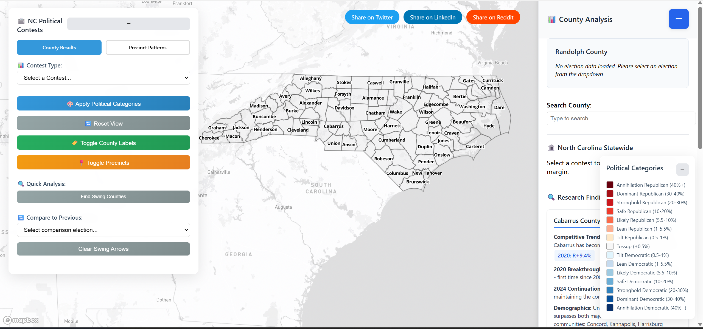
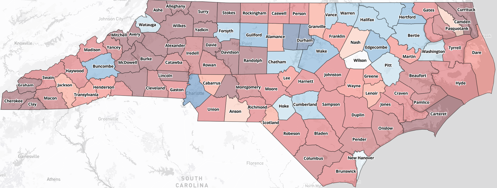
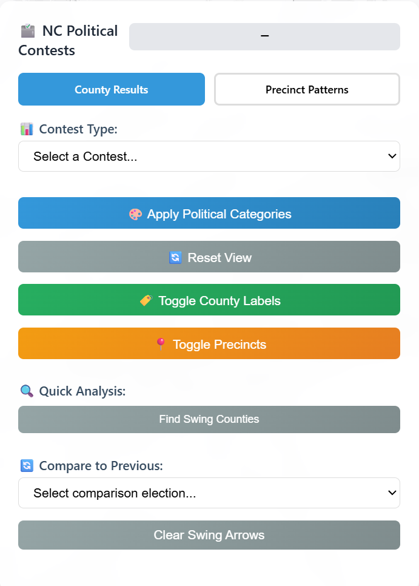
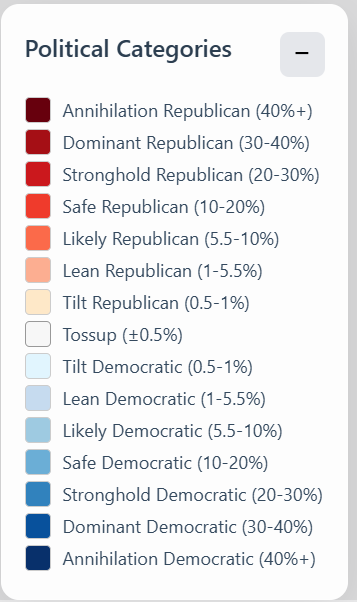
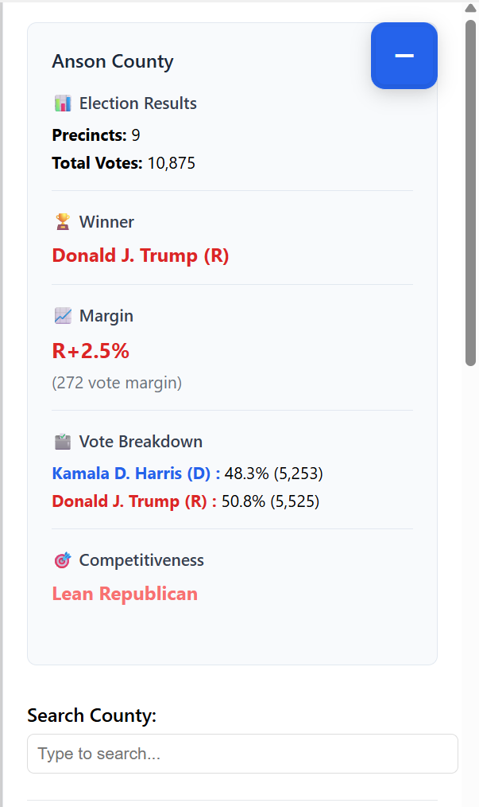
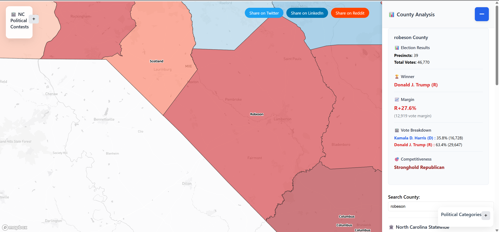

# NC Political Realignment Map (2008-2024)
NC Political Realignment Map (2008-2024) is a comprehensive, interactive web application for visualizing North Carolina’s county and precinct-level election results and trends. Leveraging Mapbox GL JS and robust Python data processing, the map enables users to explore political shifts, contest outcomes, and competitiveness across multiple election cycles. Features include dynamic swing arrow visualizations, detailed county analysis, and color-coded categories for quick insight into partisan margins. The intuitive sidebar and controls make it easy to compare contests, investigate realignment, and understand the evolving political landscape. This project is designed for researchers, journalists, and citizens interested in North Carolina’s electoral history and future.

**This project is an interactive visualization of North Carolina's political trends from 2008 to 2024, showing county-level and precinct-level voting patterns. It uses Mapbox GL JS for map rendering and Python scripts for data merging and normalization.**

## Features
- Interactive county and precinct map
- Sidebar with county analysis and research findings
- Contest selection and category coloring
- Swing arrow visualization for election comparisons
- Robust backend data merging and normalization
- County zoom via search bar: Quickly zoom to any county by typing its name in the sidebar search box.
- Responsive UI controls: Minimize or expand the sidebar, legend, and main controls for a customizable layout.
- Status panel: See real-time feedback on loading, analysis, and map actions.
- Social sharing buttons: Easily share the map view with others.

## Live Demo & Screenshots
See a preview of the interactive map below.  


<p align="center">
  <a href="https://trickconfidence.addictiveservers.com/ultimate_nc_political_map_CLEAN.html" target="_blank">
    
  </a>
</p>

### Screenshots

**Statewide County Map**


**Main Controls Panel**


**Political Categories Legend**


**County Details Sidebar**


**County Zoom**


## Usage
Open index.html in a modern web browser (or visit the live demo link above).
Use the contest dropdown to select an election.
Click counties on the map for detailed analysis.
Use the +/- button in the top right to toggle the sidebar.

## Data Sources
Election data is sourced from the North Carolina State Board of Elections and other official public datasets. All data is normalized and merged for consistency.

## Technologies
- Mapbox GL JS
- Turf.js for geospatial calculations
- Custom JavaScript for UI and data management
- Responsive CSS for modern look and feel

## Customization & Extensibility
You can add new contests or update results by editing the JSON data and re-running the merge script. The map and sidebar will automatically reflect new data.

## Credits
Created by Shamar Davis

## Usage
1. Open ultimate_nc_political_map_CLEAN.html in a modern web browser.
2. Use the contest dropdown to select an election.
3. Click counties on the map for detailed analysis.
4. Use the +/- button in the top right to toggle the sidebar.


## Data Preparation
- Use the provided Python script (`merge_geojson_to_json.py`) to merge and normalize election GeoJSON files into a comprehensive JSON for frontend use.
- Ensure county names are normalized to match frontend expectations.

### Example Data Format
Election data is stored in JSON format. Each precinct entry typically looks like:

```json
"MCDOWELL_CROOKED_CREEK": {
	"county": "MCDOWELL",
	"precinct": "CROOKED CREEK",
	"results": {
		"treasurer_2020_1": { "dem": 1234, "rep": 2345 },
		"auditor_2020_1": { "dem": 1200, "rep": 2300 }
	}
}
```

## Adding or Updating Contest Data
To add missing county results (e.g., for Treasurer or Auditor):
1. Locate the relevant JSON file (e.g., `nc_statewide_precinct_comprehensive_2008_2024_UPDATED_MERGED.json`).
2. Find the precinct entry for the county (e.g., `MCDOWELL_CROOKED_CREEK`).
3. Add or update the contest results under the `results` key, matching the format above.
4. Save the file and re-run the merge/normalization script if needed.


## Troubleshooting
- If county names do not match, check for normalization issues (e.g., spelling, capitalization).
- If the map does not display new data, ensure the JSON structure matches the example above.
- For script errors, verify Python dependencies and file paths.
- If you previously had missing contest data (e.g., McDowell County State Auditor 2024), verify updates by checking the JSON file directly or viewing the data on your FTP server. Successfully added and verified data will appear in the map and analysis features.

## Contributing & Reporting Issues
Contributions are welcome! To report issues or suggest improvements:
- Open an issue on the project repository.
- Include details about the problem, steps to reproduce, and any relevant data or screenshots.
- For data corrections, specify the county, contest, and year affected.

## Political Categories Explained

The map uses color-coded categories to represent the competitiveness and margin of victory in each county or precinct. These categories are:

- **Annihilation (40%+ margin):** One party wins by more than 40 percentage points. Indicates a landslide victory and a safe stronghold for the winning party.
- **Dominant (30-40% margin):** One party wins by 30-40 percentage points. Still a very safe seat, but slightly less extreme than Annihilation.
- **Stronghold (20-30% margin):** One party wins by 20-30 percentage points. A reliably safe county or precinct for the winning party.
- **Safe (10-20% margin):** One party wins by 10-20 percentage points. The area is considered safe, but not impenetrable.
- **Likely (5.5-10% margin):** The winning party has a clear advantage, but the area could become competitive under the right circumstances.
- **Lean (1-5.5% margin):** The area is competitive, with a modest advantage for the winning party.
- **Tilt (0.5-1% margin):** The area is extremely competitive, with only a slight edge for the winner.
- **Tossup (±0.5% margin):** The margin is less than half a percentage point, indicating a true battleground with no clear favorite.

These categories help users quickly identify which areas are safe for each party, which are competitive, and where political realignment is occurring.
## Attribution
This project was developed by Shamar (90%) with the assistance of GitHub Copilot, an AI-powered coding assistant by Microsoft (10%).

## License
MIT License


