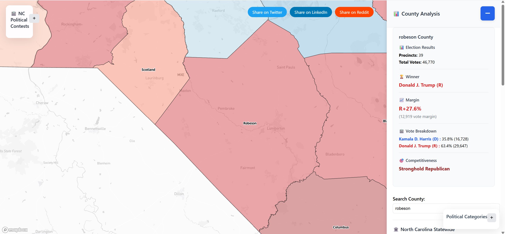

# NC Political Realignment Map (2008-2024)
NC Political Realignment Map (2008-2024) is a comprehensive, interactive web application for visualizing North Carolina’s county and precinct-level election results and trends. Leveraging Mapbox GL JS and robust Python data processing, the map enables users to explore political shifts, contest outcomes, and competitiveness across multiple election cycles. Features include dynamic swing arrow visualizations, detailed county analysis, and color-coded categories for quick insight into partisan margins. The intuitive sidebar and controls make it easy to compare contests, investigate realignment, and understand the evolving political landscape. This project is designed for researchers, journalists, and citizens interested in North Carolina’s electoral history and future.

**This project is an interactive visualization of North Carolina's political trends from 2008 to 2024, showing county-level and precinct-level voting patterns. It uses Mapbox GL JS for map rendering and Python scripts for data merging and normalization.**

## Academic & Research Applications

This project is ideal for use in university courses, research projects, and outreach initiatives focused on political science, data analysis, geography, and North Carolina studies. Faculty and students can leverage the interactive map and data tools for:

- Classroom demonstrations of electoral trends and realignment
- Student research projects and presentations
- Comparative analysis of county and precinct-level voting patterns
- Outreach and civic engagement programs

## How to Cite

If you use this project in research or coursework, please cite as follows:

> Davis, S. (2025). NC Political Realignment Map (2008-2024). Interactive web application. https://trickconfidence.addictiveservers.com/ultimate_nc_political_map_CLEAN.html

## Contact & Collaboration

For questions, collaboration opportunities, or to request data access, contact:

- Shamar Davis: [Shamard415@gmail.com]

## Educational Value

This tool provides a hands-on resource for exploring the evolving political landscape of North Carolina. It supports:

- Data-driven learning and analysis
- Visual storytelling in political science
- Interdisciplinary research across geography, history, and public policy

Universities are encouraged to integrate the map into their curriculum and research activities.

## Features
- Interactive county and precinct map
- Sidebar with county analysis and research findings
- Contest selection and category coloring
- Swing arrow visualization for election comparisons
- Robust backend data merging and normalization
- County zoom via search bar: Quickly zoom to any county by typing its name in the sidebar search box.
- Responsive UI controls: Minimize or expand the sidebar, legend, and main controls for a customizable layout.
- Status panel: See real-time feedback on loading, analysis, and map actions.
- Social sharing buttons: Easily share the map view with others.

## Live Demo & Screenshots
See a preview of the interactive map below.  


<p align="center">
  <a href="https://trickconfidence.addictiveservers.com/ultimate_nc_political_map_CLEAN.html" target="_blank">
    
  </a>
</p>


### Screenshots

**Statewide County Map**


**Main Controls Panel**


**Political Categories Legend**


**County Details Sidebar**


**County Zoom**


## Usage
Open index.html in a modern web browser (or visit the live demo link above).
Use the contest dropdown to select an election.
Click counties on the map for detailed analysis.
Use the +/- button in the top right to toggle the sidebar.

## Data Sources
Election data is sourced from the North Carolina State Board of Elections and other official public datasets. All data is normalized and merged for consistency.

## Technologies
- Mapbox GL JS
- Turf.js for geospatial calculations
- Custom JavaScript for UI and data management
- Responsive CSS for modern look and feel

## Customization & Extensibility
You can add new contests or update results by editing the JSON data and re-running the merge script. The map and sidebar will automatically reflect new data.

## Credits
Created by Shamar Davis

## Usage
1. Open ultimate_nc_political_map_CLEAN.html in a modern web browser.
2. Use the contest dropdown to select an election.
3. Click counties on the map for detailed analysis.
4. Use the +/- button in the top right to toggle the sidebar.


## Data Preparation
- Use the provided Python script (`merge_geojson_to_json.py`) to merge and normalize election GeoJSON files into a comprehensive JSON for frontend use.
- Ensure county names are normalized to match frontend expectations.

### Example Data Format
Election data is stored in JSON format. Each precinct entry typically looks like:

```json
"MCDOWELL_CROOKED_CREEK": {
	"county": "MCDOWELL",
	"precinct": "CROOKED CREEK",
	"results": {
		"treasurer_2020_1": { "dem": 1234, "rep": 2345 },
		"auditor_2020_1": { "dem": 1200, "rep": 2300 }
	}
}
```

## Adding or Updating Contest Data
To add missing county results (e.g., for Treasurer or Auditor):
1. Locate the relevant JSON file (e.g., `nc_statewide_precinct_comprehensive_2008_2024_UPDATED_MERGED.json`).
2. Find the precinct entry for the county (e.g., `MCDOWELL_CROOKED_CREEK`).
3. Add or update the contest results under the `results` key, matching the format above.
4. Save the file and re-run the merge/normalization script if needed.


## Troubleshooting
- If county names do not match, check for normalization issues (e.g., spelling, capitalization).
- If the map does not display new data, ensure the JSON structure matches the example above.
- For script errors, verify Python dependencies and file paths.
- If you previously had missing contest data (e.g., McDowell County State Auditor 2024), verify updates by checking the JSON file directly or viewing the data on your FTP server. Successfully added and verified data will appear in the map and analysis features.

## Contributing & Reporting Issues
Contributions are welcome! To report issues or suggest improvements:
- Open an issue on the project repository.
- Include details about the problem, steps to reproduce, and any relevant data or screenshots.
- For data corrections, specify the county, contest, and year affected.

## Political Categories Explained

The map uses color-coded categories to represent the competitiveness and margin of victory in each county or precinct. These categories are:

- **Annihilation (40%+ margin):** One party wins by more than 40 percentage points. Indicates a landslide victory and a safe stronghold for the winning party.
- **Dominant (30-40% margin):** One party wins by 30-40 percentage points. Still a very safe seat, but slightly less extreme than Annihilation.
- **Stronghold (20-30% margin):** One party wins by 20-30 percentage points. A reliably safe county or precinct for the winning party.
- **Safe (10-20% margin):** One party wins by 10-20 percentage points. The area is considered safe, but not impenetrable.
- **Likely (5.5-10% margin):** The winning party has a clear advantage, but the area could become competitive under the right circumstances.
- **Lean (1-5.5% margin):** The area is competitive, with a modest advantage for the winning party.
- **Tilt (0.5-1% margin):** The area is extremely competitive, with only a slight edge for the winner.
- **Tossup (±0.5% margin):** The margin is less than half a percentage point, indicating a true battleground with no clear favorite.

These categories help users quickly identify which areas are safe for each party, which are competitive, and where political realignment is occurring.

## Notable Political Realignments (2008–2024)

Over the past 16–17 years, North Carolina has experienced significant political shifts at the county level, with especially notable realignments in rural and suburban areas. This map highlights key realignments, including:

- **Rural counties that shifted from reliably Democratic to Republican, or vice versa, in major statewide or national elections.**  
  Examples: Robeson County (Democratic to Republican), Bladen County (Democratic to Republican), Surry County (Republican stronghold).

- **Suburban regions that have become more competitive, moving from “Safe” or “Stronghold” status to “Lean,” “Tilt,” or “Tossup.”**  
  Examples: Johnston County (suburban growth, especially in the Clayton area), Cabarrus County (shift toward battleground status due to Charlotte spillover), Union County (stagnant, has barely moved and its Republican lean may have been reinforced even with all of the growth in communities such as Indian Trail and Monroe).

- **Notable swings in voter turnout or partisan margins, particularly in areas experiencing demographic change or suburban growth.**  
  Examples: Wake County (suburban Democratic gains), Mecklenburg County (urban/suburban Democratic consolidation).

- **Emerging battleground counties where margins have narrowed considerably, reflecting evolving political attitudes and population shifts.**  
  Examples: New Hanover County (swing county), Pitt County (competitive margins), Craven County (narrowing margins since 2008), Alamance County (stagnant but more competitive).

For further research and verification, users are encouraged to cross-reference county-level trends and election results with Ballotpedia’s comprehensive coverage of North Carolina elections and local politics: https://ballotpedia.org/North_Carolina

These realignments are visualized through dynamic swing arrows and color-coded categories, allowing users to explore how North Carolina’s political landscape has evolved since 2008.

## Attribution
This project was developed by Shamar Davis (90%) with the assistance of GitHub Copilot, an AI-powered coding assistant by Microsoft (10%).

## License
MIT License

## Percentage Display Method

All election result percentages shown in the sidebar are rounded to two decimal places using standard rounding (e.g., 53.47%). This matches the convention used by Ballotpedia and most official sources. No truncation is applied—values are rounded to the nearest hundredth for clarity and consistency.

If you compare results with Ballotpedia, you should see matching percentages for each county and precinct.

> **Note:** Truncation of percentages was briefly tested, but the map now uses standard rounding to two decimal places for all sidebar results, matching Ballotpedia's convention. This ensures consistency with official sources and a familiar presentation for users.

## Data Accuracy & Limitations

While every effort has been made to ensure the accuracy of county and precinct-level results, some limitations may exist:
- Occasional missing precincts or contests due to incomplete public datasets
- Historical changes in county or precinct boundaries
- Data normalization challenges when merging sources
- Minor discrepancies may occur when comparing with other sources due to rounding conventions or updates

## Comparison Guidance

Users can compare map results with Ballotpedia or official state sources. Small differences may arise from rounding, data updates, or normalization. For best results, cross-reference contest, year, and county/precinct names.

## User Feedback & Feature Requests

Feedback is welcome! If you spot discrepancies, want to request additional contests/years, or suggest new features, please open an issue or contact the author directly.

## Accessibility & Browser Support

The map is designed for modern browsers (Chrome, Firefox, Edge, Safari) and supports keyboard navigation and screen readers for improved accessibility. For best performance, use the latest browser version.

## Update Log / Changelog

- **Early July 2025:** Initial release of interactive map and county/precinct analysis features
- **Early July 2025:** Added dynamic swing arrow visualizations and color-coded competitiveness categories
- **Mid July 2025:** Added Ballotpedia reference and expanded realignment examples in README
- **Late July 2025:** Added dynamic swing arrow visualizations and color-coded competitiveness categories
- **Mid August 2025:** Improved sidebar UI to show more decimal precision for results
- **August 24, 2025:** Switched sidebar percentage display from truncation to standard rounding (matches Ballotpedia)
- **August 23, 2025:** Adjusted map layer opacity for improved visual clarity and accessibility

## FAQ

**Q: Why do some counties or precincts show missing data?**
A: Data gaps may result from incomplete public datasets or historical changes in boundaries. See the Data Accuracy section for details.

**Q: How do I compare results with Ballotpedia?**
A: All sidebar percentages use standard rounding to two decimal places, matching Ballotpedia. Cross-reference contest, year, and county/precinct names for best results.

**Q: What browsers are supported?**
A: The map works best in Chrome, Firefox, Edge, and Safari. For optimal performance, use the latest version.

## Performance Tips
- For best experience, use a modern computer and a high-speed internet connection.
- If the map loads slowly, try refreshing or clearing your browser cache.
- Mobile devices are supported, but desktop browsers offer the best performance and full feature set.

## Future Roadmap
- Add support for additional election years and contests
- Enhance precinct-level analysis and visualizations
- Integrate demographic overlays and turnout trends
- Improve accessibility and mobile experience
- Enable user-submitted corrections and feedback directly in the app

## Community & Social Links
- Project website: https://trickconfidence.addictiveservers.com/ultimate_nc_political_map_CLEAN.html
- Contact: Shamard415@gmail.com

## Demo Video
A short walkthrough video will be available soon to help new users explore the map and sidebar features.

## Social Sharing Options

The interactive map includes built-in social sharing buttons. Users can easily share their current map view or analysis via:
- Twitter (X)
- Facebook
- Email
- Direct link (copy to clipboard)

These options are available in between the sidebar and main controls panel. Shared links preserve your selected contest, county, and zoom level for easy collaboration and discussion.


