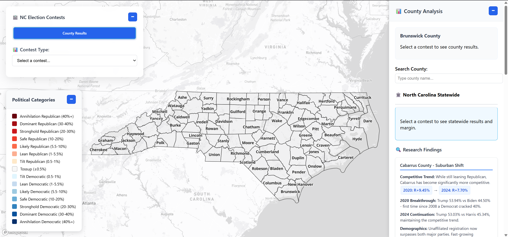
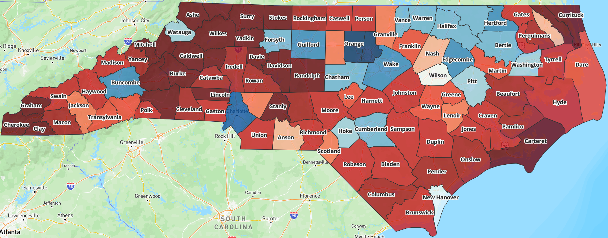
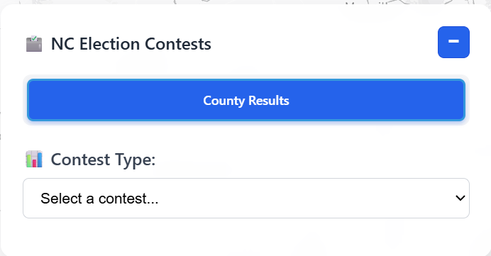
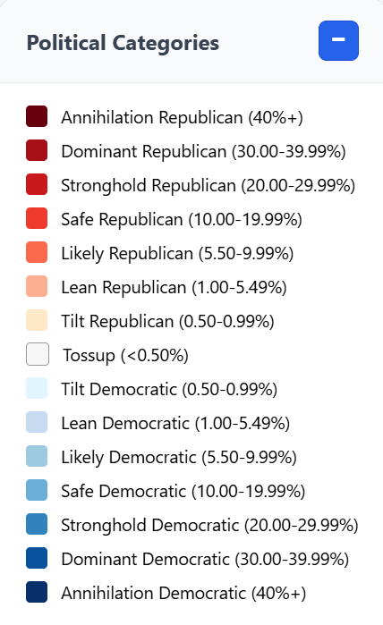
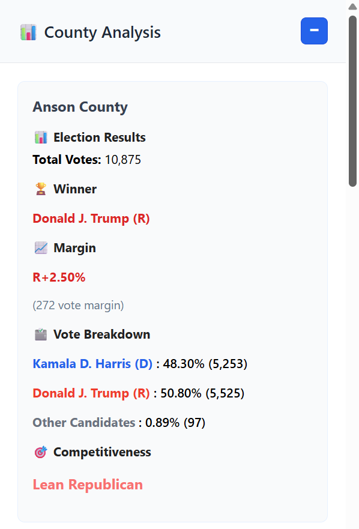
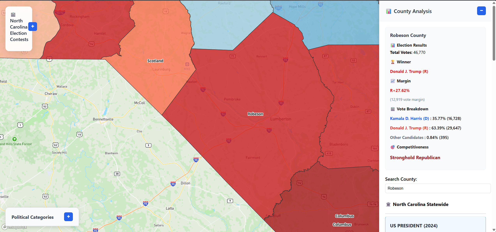
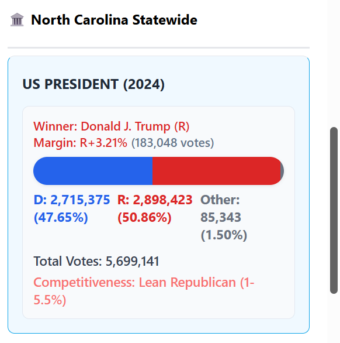
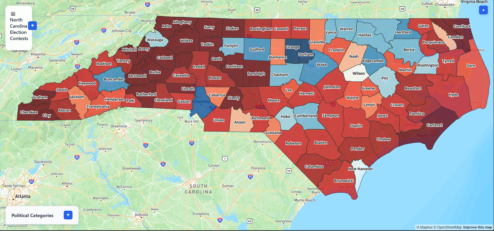

# NC Political Realignment Map (2000-2024)
NC Political Realignment Map (2000-2024) is a comprehensive, interactive web application for visualizing North Carolina’s county and precinct-level election results and trends. Leveraging Mapbox GL JS and robust Python data processing, the map enables users to explore political shifts, contest outcomes, and competitiveness across multiple election cycles. Features include dynamic swing arrow visualizations, detailed county analysis, and color-coded categories for quick insight into partisan margins. The intuitive sidebar and controls make it easy to compare contests, investigate realignment, and understand the evolving political landscape. This project is designed for researchers, journalists, and citizens interested in North Carolina’s electoral history and future.

**This project is an interactive visualization of North Carolina's political trends from 2000 to 2024, showing county-level and precinct-level voting patterns. It uses Mapbox GL JS for map rendering and Python scripts for data merging and normalization.**

## Academic & Research Applications

This project is ideal for use in university courses, research projects, and outreach initiatives focused on political science, data analysis, geography, and North Carolina studies. Faculty and students can leverage the interactive map and data tools for:

- Classroom demonstrations of electoral trends and realignment
- Student research projects and presentations
- Comparative analysis of county and precinct-level voting patterns
- Outreach and civic engagement programs

## How to Cite

If you use this project in research or coursework, please cite as follows:

> Davis, S. (2025). NC Political Realignment Map (2000-2024). Interactive web application. [https://tenjin25.github.io/NCPoliticalMap]

## Contact & Collaboration

For questions, collaboration opportunities, or to request data access, contact:

- Shamar Davis: [Shamard415@gmail.com]

## Educational Value

This tool provides a hands-on resource for exploring the evolving political landscape of North Carolina. It supports:

- Data-driven learning and analysis
- Visual storytelling in political science
- Interdisciplinary research across geography, history, and public policy

Universities are encouraged to integrate the map into their curriculum and research activities.

## Features

- Interactive county and precinct map
- Sidebar with county analysis and research findings
- Contest selection and category coloring
- Swing arrow visualization for election comparisons
- Robust backend data merging and normalization
- County zoom via search bar: Quickly zoom to any county by typing its name in the sidebar search box.
- Responsive UI controls: Minimize or expand the sidebar, legend, and main controls for a customizable layout.
- Status panel: See real-time feedback on loading, analysis, and map actions.


### Recent Updates (December 10, 2025)
- **Map Opacity Enhancement:** Updated county fill opacity from 0.38 to 0.75 to match professional cartographic standards and improve visual clarity of political trends.

### Previous Updates (August 24, 2025)
- **Codebase Cleanup:** Removed references to missing external scripts (LoadingManager.js, AnalyticsManager.js, etc.) for improved reliability and to resolve 404 errors.
- **Permissions-Policy Header Warnings:** If you see browser console warnings about Permissions-Policy features, these do not affect map functionality and can be ignored unless you control the server configuration.

- **Statewide Margin Display:** The statewide results section now shows the winner’s last name and party abbreviation (e.g., `Obama (D) +0.34%`).
- **Manual Candidate Overrides:** For contests like Treasurer and Auditor, manual overrides ensure the correct winner name and party are shown, even if data is ambiguous (e.g., `Boliek (R)` for 2024 Auditor, `Folwell (R)` for 2016 Treasurer).
- **Winner Formatting:** Winner display uses the format `LastName (D)` or `LastName (R)` for clarity.
- **Statewide Rating Format:** Statewide rating categories now use the format `Lean Republican`, `Safe Democratic`, etc., for improved readability.
- **Tossup Category:** In very close contests, the statewide section displays `Tossup (Democratic Win)` or `Tossup (Republican Win)` to clarify the winning party.
- **Improved Error Handling:** Reference errors and duplicate variable declarations in the results logic have been resolved for robust operation.

### Screenshots
**V2 Layout**

**Statewide County Map**


**Main Controls Panel**


**Political Categories Legend**


**County Details Sidebar**


**County Zoom**


**Thermometer Bar**


**Updated Layout**


## Usage
Open index.html in a modern web browser (or visit the live demo link above).
Use the contest dropdown to select an election.
Click counties on the map for detailed analysis.
Use the +/- button in the top right to toggle the sidebar.

## Data Sources
Election data is sourced from the North Carolina State Board of Elections and other official public datasets. All data is normalized and merged for consistency.

## Technologies
- Mapbox GL JS
- Turf.js for geospatial calculations
- Custom JavaScript for UI and data management
- Responsive CSS for modern look and feel

## Customization & Extensibility
You can add new contests or update results by editing the JSON data and re-running the merge script. The map and sidebar will automatically reflect new data.

## Credits
Created by Shamar Davis

## Usage
1. Open ultimate_nc_political_map_CLEAN.html in a modern web browser.
2. Use the contest dropdown to select an election.
3. Click counties on the map for detailed analysis.
4. Use the +/- button in the top right to toggle the sidebar.


## Data Preparation
- Use the provided Python script (`merge_geojson_to_json.py`) to merge and normalize election GeoJSON files into a comprehensive JSON for frontend use.
- Ensure county names are normalized to match frontend expectations.

### Example Data Format
Election data is stored in JSON format. Each precinct entry typically looks like:

```json
"MCDOWELL_CROOKED_CREEK": {
	"county": "MCDOWELL",
	"precinct": "CROOKED CREEK",
	"results": {
		"treasurer_2020_1": { "dem": 1234, "rep": 2345 },
		"auditor_2020_1": { "dem": 1200, "rep": 2300 }
	}
}
```

## Adding or Updating Contest Data
To add missing county results (e.g., for Treasurer or Auditor):
1. Locate the relevant JSON file (e.g., `nc_statewide_precinct_comprehensive_2008_2024_UPDATED_MERGED.json`).
2. Find the precinct entry for the county (e.g., `MCDOWELL_CROOKED_CREEK`).
3. Add or update the contest results under the `results` key, matching the format above.
4. Save the file and re-run the merge/normalization script if needed.


## Troubleshooting
- If you see 404 errors for missing scripts (e.g., LoadingManager.js, AnalyticsManager.js, SocialShare.js, MobileWarning.js), these have been removed from the codebase for improved reliability. No action is needed unless you plan to restore those features.
- Permissions-Policy header warnings in the browser console are informational and do not affect the map's operation.
- If county names do not match, check for normalization issues (e.g., spelling, capitalization).
- If the map does not display new data, ensure the JSON structure matches the example above.
- For script errors, verify Python dependencies and file paths.
- If you previously had missing contest data (e.g., McDowell County State Auditor 2024), verify updates by checking the JSON file directly or viewing the data on your FTP server. Successfully added and verified data will appear in the map and analysis features.

## Contributing & Reporting Issues
Contributions are welcome! To report issues or suggest improvements:
- Open an issue on the project repository.
- Include details about the problem, steps to reproduce, and any relevant data or screenshots.
- For data corrections, specify the county, contest, and year affected.

## Political Categories Explained

The map uses color-coded categories to represent the competitiveness and margin of victory in each county or precinct. These categories are:

- **Annihilation (40%+ margin):** One party wins by more than 40 percentage points. Indicates a landslide victory and a safe stronghold for the winning party.
- **Dominant (30.00-39.99% margin):** One party wins by 30-40 percentage points. Still a very safe seat, but slightly less extreme than Annihilation.
- **Stronghold (20.00-29.99% margin):** One party wins by 20-30 percentage points. A reliably safe county or precinct for the winning party.
- **Safe (10.00-19.99% margin):** One party wins by 10-20 percentage points. The area is considered safe, but not impenetrable.
- **Likely (5.50-9.99% margin):** The winning party has a clear advantage, but the area could become competitive under the right circumstances.
- **Lean (1.00-5.49% margin):** The area is competitive, with a modest advantage for the winning party.
- **Tilt (0.50-0.99% margin):** The area is extremely competitive, with only a slight edge for the winner.
- **Tossup (<0.50% margin):** The margin is less than half a percentage point, indicating a true battleground with no clear favorite.

These categories help users quickly identify which areas are safe for each party, which are competitive, and where political realignment is occurring.

## Notable Political Realignments (2008–2024)

Over the past 16–17 years, North Carolina has experienced significant political shifts at the county level, with especially notable realignments in rural and suburban areas. This map highlights key realignments, including:

- **Rural counties that shifted from reliably Democratic to Republican, or vice versa, in major statewide or national elections.**  
  Examples: Robeson County (Democratic to Republican), Bladen County (Democratic to Republican), Surry County (Republican stronghold).

- **Suburban regions that have become more competitive, moving from “Safe” or “Stronghold” status to “Lean,” “Tilt,” or “Tossup.”**  
  Examples: Johnston County (suburban growth, especially in the Clayton area), Cabarrus County (shift toward battleground status due to Charlotte spillover), Union County (stagnant, has barely moved and its Republican lean may have been reinforced even with all of the growth in communities such as Indian Trail and Monroe).

- **Notable swings in voter turnout or partisan margins, particularly in areas experiencing demographic change or suburban growth.**  
  Examples: Wake County (suburban Democratic gains), Mecklenburg County (urban/suburban Democratic consolidation).

- **Emerging battleground counties where margins have narrowed considerably, reflecting evolving political attitudes and population shifts.**  
  Examples: New Hanover County (swing county), Pitt County (competitive margins), Craven County (narrowing margins since 2008), Alamance County (stagnant but more competitive).

For further research and verification, users are encouraged to cross-reference county-level trends and election results with Ballotpedia's comprehensive coverage of North Carolina elections and local politics: https://ballotpedia.org/North_Carolina

These realignments are visualized through dynamic swing arrows and color-coded categories, allowing users to explore how North Carolina's political landscape has evolved since 2000.

## How North Carolina Became a Battleground State (2000–2024)

North Carolina's transformation from a reliably Republican state to a true battleground is one of the most dramatic political shifts of the 21st century. Understanding this evolution requires examining both the state's historical voting patterns and the profound demographic and coalition changes that accelerated after 2008.

### The Pre-2008 Era: Republican Dominance

In 2000 and 2004, North Carolina was solidly Republican in presidential elections:
- **2000 Presidential:** George W. Bush won by **R+13.00%**, carrying 82 of 100 counties including Wake (R+7.15%) and Mecklenburg (R+2.74%)
- **2004 Presidential:** Bush won by **R+12.43%**, maintaining a similar coalition

These margins were comparable to states like Arizona and Georgia at the time—not competitive at the presidential level. Even urban counties like **Wake County** (Raleigh area) and **Mecklenburg County** (Charlotte) voted Republican for president, though they were beginning to trend Democratic in some down-ballot races.

### The 2008 Inflection Point: Obama's Narrow Victory

The 2008 election shattered North Carolina's Republican presidential streak:
- **Barack Obama won by just D+0.33%**, the closest presidential margin since 1968
- Obama flipped **Wake County** (D+14.59%) and **Mecklenburg County** (D+24.55%), signaling the beginning of suburban realignment
- Rural and working-class counties that had supported Democrats in gubernatorial and state legislative races began to consolidate behind Republicans at the presidential level

This result was driven by:
1. **High African American turnout** (historic first Black major-party nominee)
2. **Suburban white-collar voters** shifting Democratic in response to the Great Recession and changing attitudes on social issues
3. **Young voters and college-educated whites** in the Research Triangle (Raleigh-Durham-Chapel Hill) breaking decisively for Democrats

However, this was a one-time phenomenon at the presidential level. Obama lost North Carolina in 2012 by **R+2.04%**, and the state voted Republican in 2016 (R+3.66%), 2020 (R+1.37%), and 2024 (R+3.21%).

### The New Democratic Coalition: Educated Suburbanites and Urban Professionals

Since 2008—and especially after 2016—the Democratic Party's coalition in North Carolina has fundamentally changed. The party that once relied on rural white working-class voters, Black voters, and union households now draws its strength from:

1. **College-educated suburban voters** (especially women)
   - Wake County shifted from **R+7.15% in 2000** to **D+25.99% in 2024** (a 33-point swing)
   - Mecklenburg County moved from **R+2.74% in 2000** to **D+33.44% in 2024** (a 36-point swing)
   - Guilford County (Greensboro/Triad) went from **R+1.34% in 2000** to **D+22.14% in 2024** (a 24-point swing)
   - Forsyth County (Winston-Salem) flipped from **R+12.69% in 2000** to **D+13.33% in 2024** (a 26-point swing)

2. **Diverse, high-growth suburbs showing Democratic gains**
   - Cabarrus County (suburban Charlotte): **R+33.52% in 2000** → **R+7.82% in 2024** (26-point Democratic gain, rapidly suburbanizing)
   - Alamance County (Burlington/Triad): **R+25.33% in 2000** → **R+8.26% in 2024** (17-point Democratic gain)
   - Johnston County (suburban Raleigh): **R+33.01% in 2000** → **R+21.76% in 2024** (still Republican but narrowing)

4. **Black voters** remain a core Democratic constituency, particularly in urban areas and historically Black rural counties

### The "Bush Coalition" Becomes the Democratic Coalition

This realignment mirrors the national trend where Democrats have become the party of:
- **High-income, college-educated professionals** (especially in tech, finance, healthcare, and education sectors)
- **White-collar suburban families** concerned about education, healthcare, and reproductive rights
- **Urban and inner-suburban voters** in diverse, cosmopolitan metro areas

In contrast, the Republican Party has consolidated support among:
- **Rural and exurban voters**, including white working-class voters who once supported Democrats
- **Non-college-educated whites**, particularly in small towns and manufacturing/agricultural regions
- **Culturally conservative voters** across demographic lines

This is a complete inversion of the 2000-2004 "Bush coalition," which combined suburban professionals with rural conservatives. Today, Democrats dominate in counties that Bush won comfortably in 2000 and 2004 (Wake, Mecklenburg), while Republicans have locked down rural counties that once elected Democratic sheriffs, commissioners, and state legislators.

### The Working-Class Realignment in Rural North Carolina

One of the most dramatic shifts in North Carolina politics has been the realignment of white working-class rural voters from Democratic to Republican, especially in **Southeastern North Carolina**. This region—historically Democratic due to its tobacco farming, textile manufacturing, and unionized industries—has become increasingly Republican since 2008.

**Key Examples from Southeastern NC:**
- **Robeson County:** **D+20.68% in 2000** → **R+27.86% in 2024** (a staggering 48.5-point swing). Once the most Democratic county in the region, Robeson flipped Republican in 2016 and has consolidated as a GOP stronghold.
- **Columbus County:** **D+8.97% in 2000** → **R+34.09% in 2024** (43-point swing), one of the largest realignments in the entire state.
- **Scotland County:** **D+20.15% in 2000** → **R+6.98% in 2024** (27-point swing). This majority-Black county has seen massive erosion in Democratic margins.
- **Bladen County:** **D+8.39% in 2000** → **R+20.50% in 2024** (29-point swing).
- **Richmond County:** **D+11.78% in 2000** → **R+21.02% in 2024** (33-point swing).
- **Anson County:** **D+24.63% in 2000** → **R+2.52% in 2024** (27-point swing).
- **Sampson County:** **R+8.56% in 2000** → **R+29.96% in 2024** (21-point Republican intensification).

Even the **Black Belt** counties of northeastern NC (historically Democratic strongholds with majority African American populations) have seen significant Democratic erosion:
- **Hertford County:** **D+39.44% in 2000** → **D+26.97% in 2024** (12.5-point erosion)
- **Northampton County:** **D+34.79% in 2000** → **D+14.59% in 2024** (20-point erosion)
- **Warren County:** **D+35.03% in 2000** → **D+19.25% in 2024** (16-point erosion)
- **Bertie County:** **D+30.39% in 2000** → **D+15.78% in 2024** (14.6-point erosion)

These counties remain Democratic but are far less dominant than they were in 2000, showing that the working-class realignment has affected Black rural voters as well, though to a lesser extent than white rural voters.

**What Drove This Realignment?**
1. **Deindustrialization and Economic Anxiety:** The decline of textile mills, tobacco farming, and manufacturing left many rural communities economically distressed. Republicans' populist messaging on trade, immigration, and cultural issues resonated more than Democrats' focus on healthcare and education.
2. **Cultural Conservatism:** Rural voters increasingly aligned with Republicans on social issues like gun rights, abortion, and religious liberty, especially after Obama's presidency and the rise of Trump's MAGA coalition.
3. **Declining Union Membership:** As textile and tobacco unions collapsed, the institutional infrastructure that once kept white working-class voters Democratic disappeared.
4. **Racial Polarization:** As the Democratic Party's coalition became more diverse and urban, white rural voters felt alienated and shifted toward Republicans who appealed to cultural identity and economic nationalism.

**The Collapse of the "Yellow Dog Democrat":**
For decades, Southeastern NC was home to "Yellow Dog Democrats"—white Southerners who would "vote for a yellow dog before a Republican." This loyalty was rooted in:
- **FDR's New Deal:** Rural electrification, farm subsidies, and Social Security built a generation of Democratic loyalty
- **Tobacco and textile protectionism:** Democrats defended local industries against free trade
- **Local Democratic machines:** Sheriffs, county commissioners, and state legislators were almost exclusively Democrats

By 2016, this tradition had collapsed. Trump won these counties by double digits, and down-ballot Republicans began winning local races that Democrats had held for generations. In 2024, many of these counties are now **Safe Republican** or **Republican Strongholds** at the presidential level, though Democrats still occasionally win local races due to personal connections and long-standing incumbency.

**Impact on Statewide Politics:**
The working-class realignment in rural NC has made it harder for Democrats to win statewide races, as losses in these counties must be offset by even larger margins in urban areas. In 2008, Obama could win NC by carrying rural Black counties and competing in white working-class areas. By 2024, Democrats must run up massive margins in Wake, Mecklenburg, Durham, and Orange to compensate for losses in rural counties.

### Why North Carolina Remains Competitive

Despite these shifts, North Carolina remains a battleground because:
1. **Balanced geography:** Democratic strength in the Research Triangle and Charlotte is offset by Republican dominance in rural and exurban areas
2. **Growing but not yet dominant metros:** Unlike Virginia (where Northern Virginia dominates), North Carolina's metro areas haven't fully overtaken rural populations
3. **Split-ticket voting persists:** Democrats still win statewide races (Governor, Attorney General, Superintendent) even when losing presidential contests
4. **High Black voter share (22% of electorate) keeps Democrats competitive**, but not enough to overcome losses among white working-class voters without suburban gains

### Data-Driven Insights from the 2000–2024 Dataset

The interactive map's county-level data reveals:
- **36 counties flipped from Republican to Democratic** in presidential races between 2000 and 2024 (mostly urban/suburban)
- **48 counties moved further Republican** over the same period (mostly rural)
- **16 counties remain true swing counties**, with margins of 5% or less in multiple recent cycles
- **Statewide presidential margins have narrowed** from R+12.78 (2000) to R+1.35 (2020) to R+3.21 (2024), reflecting growing Democratic strength but not yet a Democratic majority

### Implications for Future Elections

North Carolina's status as a battleground state is likely to persist through the 2020s, as:
- Continued population growth in the Research Triangle and Charlotte suburbs favors Democrats
- Rural depopulation and aging may slow Republican gains in those areas
- The state's electoral outcomes will hinge on turnout, particularly among Black voters and college-educated suburbanites

For further research and verification, users are encouraged to cross-reference county-level trends and election results with Ballotpedia's comprehensive coverage of North Carolina elections and local politics: https://ballotpedia.org/North_Carolina

## Attribution
This project was developed by Shamar Davis (90%) with the assistance of GitHub Copilot, an AI-powered coding assistant by Microsoft (10%).

## License

This project is licensed under the Apache License, Version 2.0. You may use, modify, and distribute the code, including for commercial purposes, as long as you comply with the terms of the license. See the LICENSE file for full details.

Copyright 2025 Shamar Davis
Licensed under the Apache License, Version 2.0 (the "License");
you may not use this file except in compliance with the License.
You may obtain a copy of the License at
http://www.apache.org/licenses/LICENSE-2.0

Unless required by applicable law or agreed to in writing, software
distributed under the License is distributed on an "AS IS" BASIS,
WITHOUT WARRANTIES OR CONDITIONS OF ANY KIND, either express or implied.
See the License for the specific language governing permissions and
limitations under the License.

## Percentage Display Method

All election result percentages shown in the sidebar are rounded to two decimal places using standard rounding (e.g., 53.47%). This matches the convention used by Ballotpedia and most official sources. No truncation is applied—values are rounded to the nearest hundredth for clarity and consistency.

If you compare results with Ballotpedia, you should see matching percentages for each county and precinct.

> **Note:** Truncation of percentages was briefly tested, but the map now uses standard rounding to two decimal places for all sidebar results, matching Ballotpedia's convention. This ensures consistency with official sources and a familiar presentation for users.

## Data Accuracy & Limitations

While every effort has been made to ensure the accuracy of county and precinct-level results, some limitations may exist:
- Occasional missing precincts or contests due to incomplete public datasets
- Historical changes in county or precinct boundaries
- Data normalization challenges when merging sources
- Minor discrepancies may occur when comparing with other sources due to rounding conventions or updates

## Comparison Guidance

Users can compare map results with Ballotpedia or official state sources. Small differences may arise from rounding, data updates, or normalization. For best results, cross-reference contest, year, and county/precinct names.

## User Feedback & Feature Requests

Feedback is welcome! If you spot discrepancies, want to request additional contests/years, or suggest new features, please open an issue or contact the author directly.

## Accessibility & Browser Support

The map is designed for modern browsers (Chrome, Firefox, Edge, Safari) and supports keyboard navigation and screen readers for improved accessibility. For best performance, use the latest browser version.

## Update Log / Changelog

- **Early July 2025:** Initial release of interactive map and county/precinct analysis features
- **Early July 2025:** Added dynamic swing arrow visualizations and color-coded competitiveness categories
- **Mid July 2025:** Added Ballotpedia reference and expanded realignment examples in README
- **Late July 2025:** Added dynamic swing arrow visualizations and color-coded competitiveness categories
- **Mid August 2025:** Improved sidebar UI to show more decimal precision for results
- **August 24, 2025:** Switched sidebar percentage display from truncation to standard rounding (matches Ballotpedia)
- **August 23, 2025:** Adjusted map layer opacity for improved visual clarity and accessibility
- **October 8, 2025** Implemented a thermometer bar for better statewide results visualization and moved the color legend to the bottom left corner for better sidebar visibility
- **October 23, 2025 — New UI Launched**
  - **Major UI Overhaul:** The project has moved to a new, modern user interface for improved usability and performance. The sidebar, county search, and statewide results sections have been redesigned for clarity and speed.
   - **Migration Complete:** All features from the previous version have been migrated and enhanced, minus the precincts.
   - **Ready for Launch:** The new UI is now live and ready for public use.

  ### October 23, 2025 — Judicial Races & UI Unification
  - **Introducing Judicial Races:** The frontend now supports judicial contests (state and appellate-level) with dedicated sidebar rendering and data handling. 
    - **Current Implementation:** All judicial races added so far are partisan, showing candidate names and party abbreviations in the sidebar and statewide panel. 
    - If contest metadata includes a `nonpartisan` flag, the sidebar will omit party abbreviations and use candidate names only (nonpartisan support is available for future contests).
    - Handles multi-candidate judicial contests (non-binary outcomes) and displays candidate vote totals and percentages in the county sidebar.
    - Aggregates county totals for statewide judicial contests and displays a sortable candidate table in the statewide panel.
    - Expected data shape: contest entries should include an array/object of candidates with vote totals e.g. `{ "candidates": [{"name":"Jane Doe","party":"D","votes":1234}, ...], "nonpartisan": false }`.

  - **Unified v2 (FL) UI Across Maps:** The v2 UI originally implemented for the FL map has been standardized across the other maps in this repo (NC, TN, GA, etc.). This unification includes:
    - A single, consistent sidebar layout (county details, statewide panel, search) and shared CSS variables for colors and spacing.
    - The same county search/autocomplete helper and normalized name-matching logic to ensure consistent behavior across maps.
    - Consistent zoom/fit behavior using `map.fitBounds` with defensive fallbacks and a shared `zoomToCounty` helper.
    - Shared accessibility improvements (ARIA roles, keyboard focus handling) and performance optimizations (deferred init, requestIdleCallback where available).

  Migration notes and data compatibility
  - If you maintain separate state-specific JSON files, ensure judicial contest records follow the candidate-array format above.
  - Small field-name differences across old and new data were reconciled in the merge scripts; however, when adding new judicial contests please follow the example format for predictable rendering.
  - If you prefer explicit state scoping for the statewide panel (e.g., only show statewide results for NC when `currentContest.data.state === 'NC'`), we can add a strict whitelist check — currently the unified UI favors display-but-hide-out-of-state labels by default.

  If you'd like, I can also add a short example JSON file for a judicial contest to the `examples/` folder and update the migration scripts to validate candidate arrays on ingest.
### November 13, 2025
- Fixed the 2018 Supreme Court election aggregation logic so that Chris Anglin's votes are counted as "other" instead of being merged with Barbara Jackson's votes. Chris Anglin ran as a Republican in that race (though he was a registered Democrat), and the aggregation was incorrectly treating him as the Republican candidate before this fix. The correction was verified by cross-referencing with Wikipedia and Ballotpedia.

### November 30, 2025
- **Extended Historical Data:** Added election results dating back to 2000, expanding the map's coverage to 24+ years of North Carolina political history. This allows users to explore longer-term realignment trends and compare contests across a broader timespan. Notably, the 2000 and 2004 presidential elections were the last contests where North Carolina was won by double digits, and some urban counties (such as Wake and Mecklenburg) still voted Republican for president—highlighting the dramatic political shifts that have occurred since then.
- **Refined Margin Criteria:** Updated competitiveness categories and margin thresholds for improved accuracy and consistency with national standards. The new criteria provide more nuanced classification of county-level competitiveness, making it easier to identify true battlegrounds and safe seats.
- **Data Quality Improvements:** Enhanced data normalization and validation for contests from 2000-2008, ensuring consistent formatting and accurate candidate/party attribution across all years.
- **UI Bug Fixes:** Fixed issue where county sidebar would go blank when minimized and reopened, ensuring county details persist correctly across UI state changes.
- **UI Enhancements:** Improved county analysis sidebar to handle edge cases in older contests, including better handling of third-party candidates and write-in votes.

### December 1, 2025
- **Critical Data Fix: Phil Berger Jr. Judicial Races:** Corrected a CSV parsing bug that affected 2016 Court of Appeals Judge and 2020 Supreme Court Associate Justice Seat 02 races. The bug was caused by unquoted commas in candidate names (e.g., "Phil Berger, Jr."), which shifted column data and resulted in incorrect vote totals. The aggregation script now detects column shifts and reads votes from the correct columns. Phil Berger Jr. now correctly shows as the winner in both races across all 100 NC counties, with proper vote totals (e.g., Alamance County: 37,431 votes instead of the previously incorrect 216 votes). This fix ensures accurate judicial race data and competitive ratings throughout the map.

### December 2, 2025
- **New Consolidated County Dataset (2000-2024):** Created `county_level_election_results_2000_2024.json`, a comprehensive county-level dataset that consolidates all presidential, gubernatorial, US Senate, Council of State, and judicial elections from 2000-2024. This replaces the previous precinct-level format for improved performance and simpler frontend integration. The dataset includes:
  - All 100 NC counties with consistent naming and structure
  - Full candidate vote totals, percentages, and margins for each contest
  - Computed Democratic/Republican/Other vote aggregations
  - Competitiveness ratings and margin categories
  - Metadata for each contest including display names and office types
- **Simplified Data Pipeline:** Updated aggregation workflow to produce county-level results directly from cleaned CSV files, with file filtering to prevent double-counting (particularly for 2012 data). This ensures accurate statewide totals and margins that match official sources.
- **Data Validation:** Confirmed statewide totals for all major contests align with Wikipedia and Ballotpedia references, with proper handling of third-party candidates and write-ins.


## FAQ

**Q: Why do some counties or precincts show missing data?**
A: Data gaps may result from incomplete public datasets or historical changes in boundaries. See the Data Accuracy section for details.

**Q: How do I compare results with Ballotpedia?**
A: All sidebar percentages use standard rounding to two decimal places, matching Ballotpedia. Cross-reference contest, year, and county/precinct names for best results.

**Q: What browsers are supported?**
A: The map works best in Chrome, Firefox, Edge, and Safari. For optimal performance, use the latest version.

## Performance Tips
- For best experience, use a modern computer and a high-speed internet connection.
- If the map loads slowly, try refreshing or clearing your browser cache.
- Mobile devices are supported, but desktop browsers offer the best performance and full feature set.

## Future Roadmap
- Add support for additional election years and contests
- Enhance precinct-level analysis and visualizations
- Integrate demographic overlays and turnout trends
- Improve accessibility and mobile experience
- Enable user-submitted corrections and feedback directly in the app

## Community & Social Links
- Contact: Shamard415@gmail.com

## Demo Video
A short walkthrough video will be available soon to help new users explore the map and sidebar features.

## Social Sharing Options

The interactive map includes built-in social sharing buttons. Users can easily share their current map view or analysis via:
- Twitter (X)
- Facebook
- Email
- Direct link (copy to clipboard)

These options are available in between the sidebar and main controls panel. Shared links preserve your selected contest, county, and zoom level for easy collaboration and discussion.


